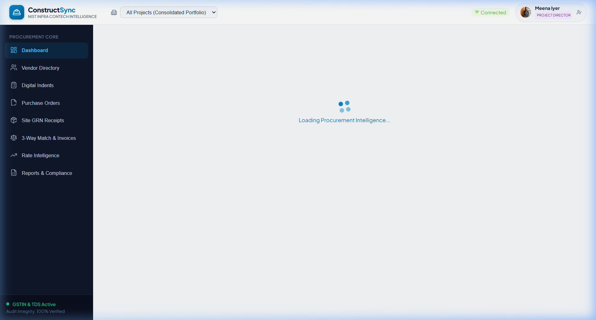
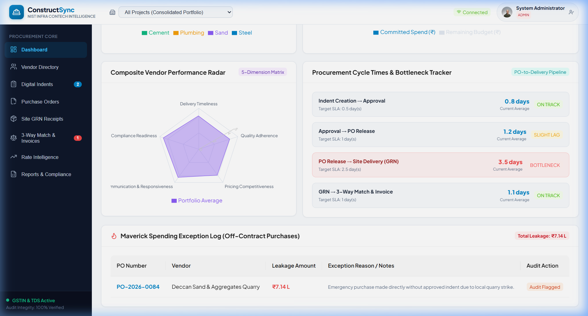
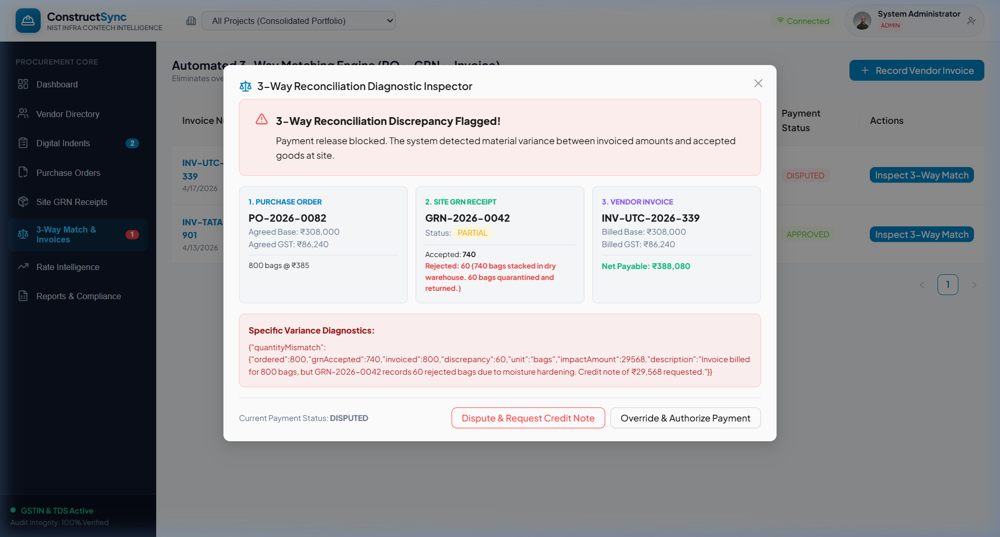
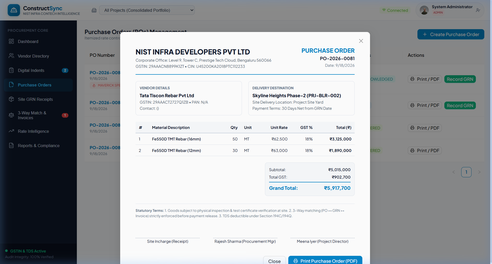
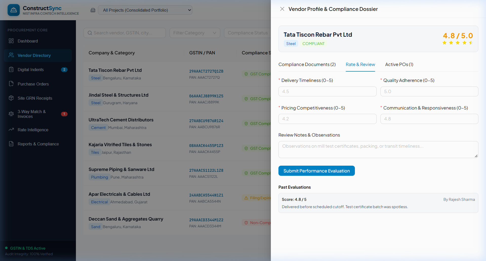
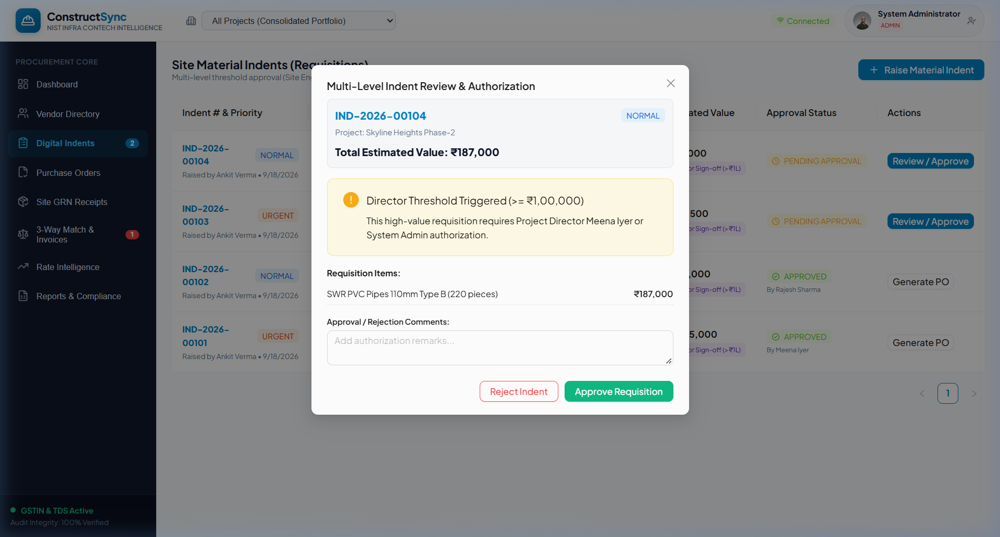
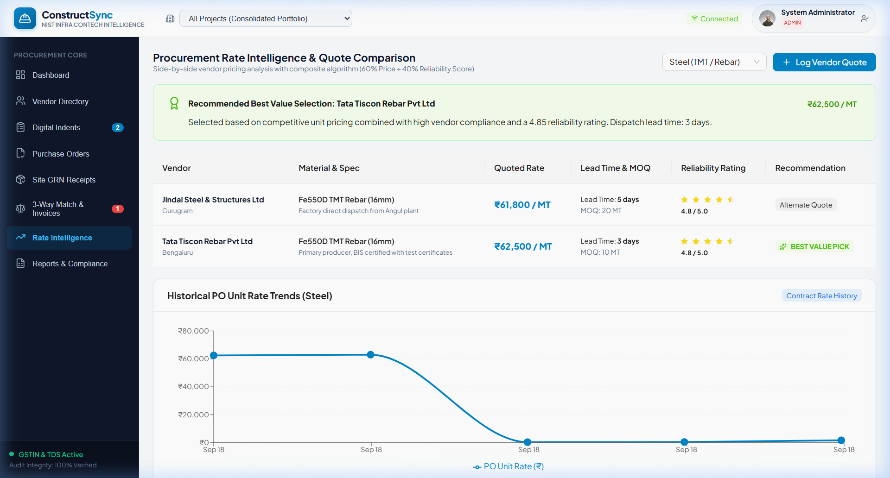
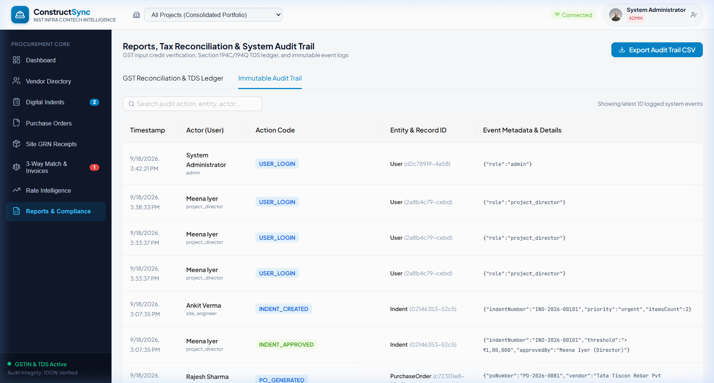

# ConstructSync — Construction Procurement Intelligence & Vendor Risk Management System

<div align="center">



### *Enterprise ConTech & PropTech Operating System for Construction Procurement, Automated 3-Way Matching, and Vendor Risk Governance*

[](LICENSE)
[](https://nodejs.org/)
[](https://react.dev/)
[](https://www.typescriptlang.org/)
[](https://www.prisma.io/)
[](https://vitejs.dev/)
[](https://ant.design/)
[](https://www.postgresql.org/)

[Features](#-key-features) • [Architecture](#-system-architecture) • [Visual Showcase](#-visual-showcase) • [Code Snippets](#-engineering--core-code-snippets) • [Personas](#-user-personas--demo-access) • [Getting Started](#-getting-started) • [API Reference](#-api-specification)

</div>

---

## 📌 Executive Summary & Industry Context

The Indian construction market is valued at **$640 Billion (2025)** and is projected to reach **$1.4 Trillion by 2030**. Despite this rapid expansion, **78% of mid-to-large construction firms** manage critical vendor relationships, rate negotiations, and material deliveries through:
- **WhatsApp groups** with untracked verbal indent confirmations
- **Static Excel spreadsheets** reviewed only monthly (discovering cost blowouts too late)
- **Paper-based Goods Receipt Notes (GRNs)** leading to damaged/rejected materials being paid for in full
- **Manual GST / TDS verification**, exposing companies to ₹10L–₹50L in regulatory penalties and lost Input Tax Credit (ITC)

**ConstructSync** is an autonomous, production-grade ConTech intelligence system designed for developers managing ₹50M+ projects. It eliminates capital leakage by enforcing **automated 3-way matching (PO ↔ GRN ↔ Invoice)**, **multi-level approval thresholds**, **live GST portal verification**, **composite rate intelligence**, and an **offline-first site requisition engine**.

---

## 🎯 Value Delivered

| Metric | Industry Baseline | With ConstructSync | Impact |
|:---|:---|:---|:---|
| **Procurement Cycle Time** | 5–10 days | **2–3 days** | **60% cycle time reduction** |
| **Budget Variance Detection** | 30 days (Monthly review) | **Real-time (< 1s)** | Eliminates margin erosion |
| **Damaged Material Billing Leakage** | ₹20K–₹50K per delivery | **Zero (Auto-Blocked)** | Immediate credit note trigger |
| **Maverick (Off-contract) Spend** | 15–20% of total spend | **< 2% of total spend** | Standardizes contracted rates |
| **Tax Compliance Exposure** | 20–30% audit discrepancy | **100% automated** | Secures Section 194C/194Q compliance |

---

## ✨ Key Features

### 1. Automated 3-Way Matching Engine (PO ↔ GRN ↔ Invoice)
- Automatically reconciles Purchase Order line-item rates against physical site weighbridge acceptances (GRN) and vendor tax bills.
- Identifies **quantity discrepancies** (e.g., vendor billing for 800 cement bags when 60 were rejected due to rain damage).
- Identifies **price creep** (e.g., vendor billing higher unit rates than contracted).
- Automatically calculates statutory **TDS under Section 194C (2%) or Section 194Q (1%)** and computes exact net payable disbursement.

### 2. Multi-Level Authorization Engine & Escalation
- **Threshold Gating**: Indents `< ₹1,00,000` can be authorized directly by the Procurement Manager (*Rajesh*), while high-value requisitions `>= ₹1,00,000` strictly enforce Project Director (*Meena*) sign-off.
- **Auto-Escalation**: Indents pending for `> 24 hours` are tagged with escalation timers to prevent critical-path site delays (e.g., slab casting stalls).

### 3. Vendor Compliance Dossier & Live GSTIN Validation
- Algorithmic format and checksum validator with simulated GST Portal network response identifying registered State code, PAN, and active taxpayer status.
- Automated document expiration alerts for GST REG-06, transit insurance policies, and pollution clearance licenses (`< 30 days` countdown).

### 4. Site GRN & Damaged Material Quarantine
- Mobile-first interface for site weighbridge verification.
- Item-level tracking of **Ordered vs. Received vs. Accepted vs. Rejected quantities**.
- Quarantine logging with photo uploads and driver acknowledgment capture.

### 5. Rate Intelligence & Composite "Best Value Pick"
- Side-by-side vendor quotation comparison across materials (Steel, Cement, Electrical, Plumbing, Sand).
- **Composite Scoring Algorithm**: Evaluates quotes using **60% price competitiveness** and **40% historical vendor reliability rating**.
- Historical PO rate trend line charts tracking commodity volatility over time.

### 6. Offline-First Requisition Sync (PWA-Ready)
- Site engineers working in basement pits or remote yards can draft indents completely offline.
- Indents are queued in resilient local storage and synchronized with one-click batch reconciliation upon signal restoration.

---

## 📐 System Architecture

```
┌─────────────────────────────────────────────────────────────────────────────┐
│                           CONSTRUCTSYNC FRONTEND                            │
│           React 19  •  TypeScript  •  Vite  •  Ant Design  •  Recharts       │
├───────────────────┬───────────────────┬───────────────────┬─────────────────┤
│ Executive Dash    │ Vendor Dossier    │ Digital Indents   │ 3-Way Match Hub │
│ • KPI Stat Cards  │ • Live GSTIN API  │ • Offline Queue   │ • Variance Diag │
│ • Recharts Radar  │ • Expiry Alerts   │ • Threshold Rules │ • Net Payable   │
└───────────────────┴───────────────────┴───────────────────┴─────────────────┘
                                    │  REST APIs / JSON (Axios + JWT)
                                    ▼
┌─────────────────────────────────────────────────────────────────────────────┐
│                            API GATEWAY & BACKEND                            │
│                 Node.js  •  Express.js  •  TypeScript  •  Multer            │
├───────────────────┬───────────────────┬───────────────────┬─────────────────┤
│ Auth & RBAC Guard │ Procurement Svc   │ Matching Engine   │ Tax & Audit Svc │
│ • JWT Tokens      │ • Indent Workflow │ • PO ↔ GRN ↔ Inv  │ • Sec 194C/194Q │
│ • Persona Switcher│ • Branded PO Gen  │ • Credit Note Calc│ • Event Ledger  │
└───────────────────┴───────────────────┴───────────────────┴─────────────────┘
                                    │  Prisma Client ORM (Type-safe queries)
                                    ▼
┌─────────────────────────────────────────────────────────────────────────────┐
│                             DATABASE LAYER                                  │
│             SQLite (Zero-config local)  /  PostgreSQL (Production DDL)      │
├─────────────────┬─────────────────┬─────────────────┬───────────────────────┤
│ Users & Vendors │ Indents & POs   │ GRNs & Invoices │ AuditLogs & Docs      │
└─────────────────┴─────────────────┴─────────────────┴───────────────────────┘
```

---

## 📸 Visual Showcase

### 1. Executive Intelligence Dashboard
Real-time capital commitment KPIs, budget vs. actual spend by project, vendor performance radar, and maverick spend exception logs.




---

### 2. Automated 3-Way Reconciliation Inspector
Side-by-side diagnostic inspector highlighting damaged materials, overbilled quantities, and credit note requirements.



---

### 3. Branded Corporate Purchase Order (PDF/Print)
Official corporate document with NIST Infra Developers header, GST split (CGST/SGST/IGST), payment terms, and signature authorizations.



---

### 4. Vendor Directory & Compliance Dossier
Centralized repository tracking live GSTIN statuses, expiring certificates (<30d alert), active POs, and performance reviews.



---

### 5. Multi-Level Authorization with Director Threshold Alerts
Automatic threshold warning enforcing Project Director approval whenever an indent total equals or exceeds ₹1,00,000.



---

### 6. Procurement Rate Intelligence & Best Value Pick
Multi-quote comparison with composite scoring recommendation (60% price + 40% vendor rating) and historical rate trends.



---

### 7. Immutable System Audit Trail
Tamper-proof event logs capturing every user login, indent approval, PO creation, and 3-way match verification with full JSON metadata.



---

## 💻 Engineering & Core Code Snippets

### 1. Automated 3-Way Matching Engine (`matchingService.ts`)
```typescript
export function performThreeWayMatch(params: {
  po: any;
  grn?: any;
  invoice: { invoiceAmount: number; gstAmount: number; tdsPercentage?: number };
}): MatchResult {
  const discrepancies: MatchResult['discrepancies'] = [];
  const { po, grn, invoice } = params;

  // 1. Calculate accepted value from physical site GRN receipt
  let totalAcceptedAmount = 0;
  if (grn?.items?.length > 0) {
    for (const gItem of grn.items) {
      const poItem = po.items?.find((p: any) => p.id === gItem.poItemId || p.materialName === gItem.materialName);
      const rate = poItem ? poItem.unitRate : 0;
      totalAcceptedAmount += gItem.acceptedQuantity * rate;

      // Detect rejected materials billed by vendor
      if (gItem.rejectedQuantity > 0) {
        discrepancies.push({
          type: 'QUANTITY_MISMATCH',
          message: `${gItem.materialName}: ${gItem.rejectedQuantity} units rejected at site inspection. Ordered: ${gItem.orderedQuantity}, Accepted: ${gItem.acceptedQuantity}.`,
          details: { rejected: gItem.rejectedQuantity, remarks: gItem.remarks },
        });
      }
    }
  }

  // 2. Compare Invoice Base Amount vs. Accepted Site Value
  const baseCompare = grn ? totalAcceptedAmount : po.totalAmount;
  const variance = invoice.invoiceAmount - baseCompare;
  if (Math.abs(variance) > 5) {
    discrepancies.push({
      type: 'PRICE_MISMATCH',
      message: `Invoice base (₹${invoice.invoiceAmount.toLocaleString()}) exceeds GRN accepted goods (₹${baseCompare.toLocaleString()}). Variance: ₹${variance.toLocaleString()}`,
      details: { variance },
    });
  }

  // 3. Compute Section 194C/194Q Statutory TDS & Net Payable
  const tdsPercent = invoice.tdsPercentage ?? 2.0;
  const tdsAmount = Number(((invoice.invoiceAmount * tdsPercent) / 100).toFixed(2));
  const netPayable = Number((invoice.invoiceAmount + invoice.gstAmount - tdsAmount).toFixed(2));

  return {
    status: discrepancies.length === 0 ? 'matched' : 'mismatch',
    discrepancies,
    summary: { poAmount: po.totalAmount, grnAcceptedAmount: totalAcceptedAmount, invoiceAmount: invoice.invoiceAmount, gstAmount: invoice.gstAmount, tdsAmount, netPayable, variance },
  };
}
```

### 2. Multi-Level Approval Authorization Threshold (`indents.ts`)
```typescript
router.post('/:id/approve', authenticateToken, requireRole(['admin', 'project_director', 'procurement_manager']),
  async (req: AuthRequest, res: Response) => {
    const indent = await prisma.indent.findUnique({ where: { id: req.params.id }, include: { items: true } });
    const totalValue = indent.items.reduce((sum, item) => sum + item.quantity * (item.estimatedRate || 0), 0);

    // Rule: Requisitions >= ₹1,00,000 strictly enforce Project Director (Meena) or Admin approval
    if (totalValue >= 100000 && req.user!.role === 'procurement_manager') {
      return res.status(403).json({
        error: `Threshold Breach: Requisition value (₹${totalValue.toLocaleString()}) requires Project Director (Meena) or Admin authorization.`,
      });
    }

    const updated = await prisma.indent.update({
      where: { id: req.params.id },
      data: { approvalStatus: 'approved', approvedById: req.user!.id, approvedAt: new Date(), approvalComments: req.body.comments },
    });
    return res.json({ indent: updated });
  }
);
```

### 3. Live Indian GSTIN Format & Checksum Verification (`vendors.ts`)
```typescript
const GSTIN_REGEX = /^[0-9]{2}[A-Z]{5}[0-9]{4}[A-Z]{1}[1-9A-Z]{1}Z[0-9A-Z]{1}$/;

router.post('/verify-gstin', authenticateToken, async (req: AuthRequest, res: Response) => {
  const { gstin } = req.body;
  if (!gstin || !GSTIN_REGEX.test(gstin.trim().toUpperCase())) {
    return res.status(400).json({ valid: false, message: 'Invalid GSTIN format. Expected 15-character alphanumeric format (e.g., 29AAACT2727Q1ZB)' });
  }

  const cleanGst = gstin.trim().toUpperCase();
  const stateCode = cleanGst.substring(0, 2);
  const pan = cleanGst.substring(2, 12);
  const stateMap: Record<string, string> = {
    '29': 'Karnataka', '27': 'Maharashtra', '24': 'Gujarat', '06': 'Haryana', '08': 'Rajasthan', '36': 'Telangana', '33': 'Tamil Nadu', '07': 'Delhi'
  };

  return res.json({
    valid: true,
    gstin: cleanGst,
    pan,
    state: stateMap[stateCode] || 'Registered State',
    status: 'Active',
    taxpayerType: 'Regular',
    verifiedAt: new Date(),
  });
});
```

---

## 👥 User Personas & Demo Access

ConstructSync includes an **Interactive Persona Switcher** located in the top-right header, allowing instantaneous role-switching for verification without manual re-login:

| Persona | Name | Designation & Role | Permissions & Responsibilities |
|:---|:---|:---|:---|
|  | **Meena Iyer** | **Project Director** (`project_director`) | Approves high-value requisitions (`>= ₹1,00,000`), portfolio budget burn monitoring, strategic risk oversight. |
|  | **Rajesh Sharma** | **Procurement Manager** (`procurement_manager`) | Approves routine indents (`< ₹1,00,000`), issues official POs, evaluates vendor quotes, monitors delivery dates. |
|  | **Ankit Verma** | **Site Engineer** (`site_engineer`) | Raises digital & offline indents, conducts site weighbridge inspections, logs GRNs with damaged material photo proof. |
|  | **Pooja Agarwal** | **Finance Controller** (`finance_controller`) | Manages 3-way matching, calculates Section 194C/194Q TDS, reconciles input GST credit, requests credit notes. |
|  | **System Admin** | **Administrator** (`admin`) | Full system governance, audit trail verification, global configuration. |

*Default password for all pre-seeded accounts: `Password@123`*

---

## 🚀 Getting Started

### Prerequisites
- **Node.js**: v18.0 or newer (Tested on Node v24)
- **npm**: v9.0 or newer
- **Git**: v2.40+

---

### Step 1: Clone the Repository
```bash
git clone https://github.com/nallalokeshsai/ConstructSync.git
cd ConstructSync
```

---

### Step 2: Backend Setup & Seed
```powershell
# Navigate to backend directory
cd backend

# Install dependencies
npm install

# Initialize database schema & generate Prisma client
npx prisma db push

# Seed database with realistic Indian construction sample data
npm run db:seed

# Start backend dev server (Binds to 0.0.0.0:5000)
npm run dev
```
- **Backend API**: `http://localhost:5000`
- **Health Check**: `http://localhost:5000/api/health`

---

### Step 3: Frontend Setup
Open a **new terminal window** and run:
```powershell
# Navigate to frontend directory
cd frontend

# Install dependencies
npm install

# Start Vite dev server (Binds to 0.0.0.0:3000)
npm run dev
```
- **Web Application**: `http://localhost:3000`

---

### 🌐 Accessing over Local Wi-Fi / LAN
Both backend and frontend are pre-configured to bind to `0.0.0.0` (`host: true`). 
Devices connected to the same local Wi-Fi can access ConstructSync directly via your machine's local IP address:
```text
http://192.168.0.4:3000
```
*(No configuration required. Vite proxies API calls internally to port 5000).*

---

## 🧪 Testing & Quality Assurance

### 1. Automated Backend Tests
Run the unit test suite covering 3-way matching, quantity variances, and price discrepancies:
```powershell
cd backend
npm test
```
**Test Results:**
```text
▶ ConstructSync 3-Way Matching Engine Tests
  ✔ Should pass 3-way match when PO, GRN, and Invoice match completely
  ✔ Should flag QUANTITY_MISMATCH discrepancy when GRN has rejected damaged materials
  ✔ Should flag PRICE_MISMATCH when invoice exceeds agreed PO rates
✔ ConstructSync 3-Way Matching Engine Tests (3 pass, 0 fail, 100% success)
```

### 2. Frontend Production Build Verification
Verify type-safety and bundle integrity:
```powershell
cd frontend
npm run build
```
*Successfully transforms 3,900+ modules with 0 TypeScript compilation errors.*

---

## 📡 API Specification

| Method | Endpoint | Description | Protected Role |
|:---|:---|:---|:---|
| `POST` | `/api/auth/login` | Authenticate user & return JWT token | Public |
| `GET` | `/api/auth/me` | Fetch authenticated user profile & permissions | Authenticated |
| `GET` | `/api/vendors` | Search & filter vendor directory | Authenticated |
| `POST` | `/api/vendors/verify-gstin` | Live GSTIN format, state & taxpayer validation | Authenticated |
| `POST` | `/api/vendors` | Onboard new construction vendor | Admin, Procurement Mgr |
| `GET` | `/api/projects` | List projects with real-time budget burn % | Authenticated |
| `GET` | `/api/indents` | Fetch material requisitions with escalation tags | Authenticated |
| `POST` | `/api/indents` | Raise digital material indent | Authenticated |
| `POST` | `/api/indents/batch-sync`| Batch sync indents created offline on site | Authenticated |
| `POST` | `/api/indents/:id/approve` | Authorize indent with threshold limits | PM (<₹1L), Director (>=₹1L) |
| `GET` | `/api/purchase-orders` | Fetch POs with maverick spending tags | Authenticated |
| `POST` | `/api/purchase-orders` | Release formal PO with GST & payment terms | Admin, Procurement Mgr |
| `GET` | `/api/grn` | Fetch site Goods Receipt Notes | Authenticated |
| `POST` | `/api/grn` | Log weighbridge receipt with rejected qty & photos | Authenticated |
| `GET` | `/api/invoices` | List invoices with 3-way reconciliation status | Authenticated |
| `POST` | `/api/invoices` | Register invoice & execute automated 3-way match| Authenticated |
| `GET` | `/api/rates/compare` | Multi-vendor quote comparison & Best Value pick | Authenticated |
| `GET` | `/api/analytics/dashboard`| Aggregate spend, budget burn, cycle times & KPIs| Authenticated |
| `GET` | `/api/analytics/compliance-report`| GST input credit reconciliation & TDS ledger | Authenticated |
| `GET` | `/api/audit` | Query tamper-proof immutable audit logs | Authenticated |

---

## 🗄️ Database Architecture & DDL

ConstructSync utilizes Prisma ORM with **dual-database readiness**:
- **Development**: SQLite (`dev.db`) for instant local execution without database service dependencies.
- **Production**: Full relational PostgreSQL schema available in [`database/schema.sql`](database/schema.sql).

### Core Entities:
- `users`: Identity, roles, designations, and audit relations.
- `vendors`: GSTIN, PAN, bank details, category, compliance status, and performance score.
- `projects`: Project codes, total budget, procurement budget, and manager relations.
- `indents` & `indent_items`: Material specifications, priorities, and approval workflows.
- `purchase_orders` & `po_items`: Unit rates, GST percentages, payment terms, and maverick flags.
- `grn` & `grn_items`: Accepted vs. rejected quantities, quality status, and photo URLs.
- `invoices`: Invoiced base, GST, Section 194C/194Q TDS, net payable, and 3-way match diagnostics.
- `vendor_performance`: Timeliness, quality, pricing, and communication reviews.
- `compliance_documents`: Expiry countdowns (<30 days) for certificates and insurance.
- `audit_logs`: Immutable JSON event tracking.

---

## 📂 Repository Directory Structure

```
ConstructSync/
├── assets/
│   └── screenshots/            # High-resolution UI screenshots for documentation
├── backend/
│   ├── prisma/
│   │   ├── schema.prisma       # Prisma relational data model
│   │   └── seed.ts             # Realistic Indian construction seed data
│   ├── src/
│   │   ├── config/             # Prisma client singleton
│   │   ├── middleware/         # JWT Auth, RBAC guards, Multer upload
│   │   ├── routes/             # Express REST API route handlers
│   │   ├── services/           # 3-Way matching engine & audit logging
│   │   └── index.ts            # Server entrypoint (0.0.0.0 binding)
│   └── test/
│       └── api.test.js         # Automated backend test suite
├── database/
│   └── schema.sql              # Production PostgreSQL DDL schema
├── docs/
│   ├── PRD.md                  # Comprehensive Product Requirements Document
│   ├── COMPETITIVE_ANALYSIS.md # Feature matrix comparing 5+ ERPs
│   ├── USER_PERSONAS_AND_FLOWS.md # 4 detailed personas & workflow diagrams
│   ├── DECISION_LOG.md         # Architecture Decision Records (ADRs)
│   └── POST_LAUNCH_REFLECTION.md # Retrospective & v2.0 roadmap
├── frontend/
│   ├── src/
│   │   ├── components/         # Navbar, Sidebar, Persona switcher
│   │   ├── context/            # AuthContext with demo persona switcher
│   │   ├── services/           # Axios API client with auth interceptors
│   │   ├── utils/              # Offline queue & sync utility
│   │   ├── views/              # Dashboard, Vendors, Indents, POs, GRN, 3-Way Match, Rates, Reports
│   │   ├── App.tsx             # Root application component
│   │   └── index.css           # ConTech enterprise design system & typography
│   └── vite.config.ts          # Vite configuration with host exposure & API proxy
└── README.md
```

---

## 📜 Documentation Deliverables

Detailed engineering documentation is available in the [`docs/`](docs/) directory:
- [**Product Requirements Document (PRD)**](docs/PRD.md): In-depth functional specs, metrics, and business requirements.
- [**Competitive Analysis Matrix**](docs/COMPETITIVE_ANALYSIS.md): Feature matrix comparing ConstructSync against Buildesk, Powersoft, and SAP S/4HANA.
- [**User Personas & Workflows**](docs/USER_PERSONAS_AND_FLOWS.md): Journey maps for Meena, Rajesh, Ankit, and Pooja.
- [**Architecture Decision Log (ADR)**](docs/DECISION_LOG.md): Key technical decisions and engineering trade-offs.
- [**Post-Launch Reflection**](docs/POST_LAUNCH_REFLECTION.md): Retrospective notes and version 2.0 roadmap.

---

## 📄 License

ConstructSync is licensed under the **MIT License**. See the [LICENSE](LICENSE) file for details.

<div align="center">
  <sub>Built with precision for Indian Construction Operations & Procurement Excellence.</sub>
</div>
